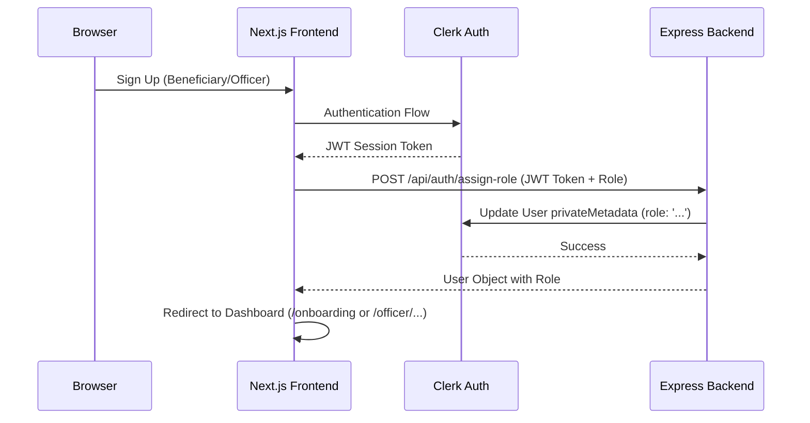

# Clerk Secure Role Integration Guide

This document outlines the architecture and implementation of the secure role-based access control (RBAC) system in FinTrust, using Clerk's `privateMetadata` as the single source of truth.

## Architecture Overview

FinTrust uses a hybrid approach to ensure maximum security while maintaining a smooth user experience:

1.  **Source of Truth**: Clerk `privateMetadata`. This is NOT accessible from the client, preventing users from modifying their own roles.
2.  **Role Manager (Backend)**: An Express server acts as the gatekeeper for role modifications and verification.
3.  **Client Sync (Frontend)**: A custom hook (`useUserRole`) synchronizes the backend-managed roles with the frontend state and redirects users to appropriate dashboards.

### Data Flow Diagram



---

## Backend Implementation Details

**Base URL**: `http://localhost:5000/api/auth`

### 1. Security Middleware (`auth.ts`)
The server uses `verifyToken` from `@clerk/backend` for **networkless verification**.
- **Requirement**: `CLERK_SECRET_KEY` must be present in `server/.env`.
- **Logic**: It verifies the JWT token from the client, extracts the `sub` (userId), and attaches the user's role from Clerk's `privateMetadata` to the request object.

### 2. Endpoints
- `GET /me`: Returns the current user's information and role. Returns `404 (ROLE_NOT_SET)` if no role is found in metadata.
- `POST /assign-role`: Validates the requested role (`BENEFICIARY` | `OFFICER`) and updates Clerk's `privateMetadata`.

### 3. Usage in Routes
Protect any backend route using the `requireRole` middleware:
```typescript
import { authenticateUser, requireRole } from '../middleware/auth'

router.get('/applications', authenticateUser, requireRole(['OFFICER']), async (req, res) => {
  // Only accessible by officers
})
```

---

## Frontend Implementation Details

### 1. The `useUserRole` Hook
This is the primary way to interact with roles on the frontend.
- **Auto-Sync**: Fetches the role from the backend on mount.
- **Persistence**: Synced with `localStorage` for backwards compatibility with legacy components.
- **Redirect Support**: Uses `pendingRole` logic in `localStorage` to handle race conditions where a user might be redirected by Clerk before the role is assigned.

### 2. The `RoleAssignment` Component
Mounted in the `RootLayout`, this component monitors authentication state and redirects users:
- **Auth Paths**: Redirects from `/sign-up`, `/login`, and `/` to the correct dashboard if a role exists.
- **Dashboard Mapping**: 
  - `BENEFICIARY` → `/onboarding`
  - `OFFICER` → `/officer/applications`

### 3. Usage in Components
```tsx
const { role, assignRole, loading } = useUserRole();

// Checking role
if (role === 'OFFICER') { ... }

// Assigning role during signup
await assignRole('BENEFICIARY');
```

---

## Guidelines for Teams

### For the Backend Team
- **Never trust client-side roles**. Always use the `authenticateUser` middleware which reads directly from Clerk's private metadata.
- **Keep roles in Sync**: If you add new roles to the system, update the `ClerkService` validation and the `requireRole` middleware.
- **Secret Management**: Ensure `CLERK_SECRET_KEY` is never exposed in client bundles or Git.

### For the Frontend Team
- **Use the Hook**: Always use `useUserRole()` instead of direct `localStorage` or `useAuth()` metadata access.
- **Protect Pages**: Use the `RoleProtected` component to wrap entire page contents.
- **Path Consistency**: Ensure all dashboard paths match the `RoleAssignment` redirect logic.

---

## Environment Configuration

### Server (`.env`)
```env
# Database
MONGODB_URI=...

# Clerk Configuration
CLERK_PUBLISHABLE_KEY=...
CLERK_SECRET_KEY=...

# Server
PORT=5000
NODE_ENV=development

# CORS
CORS_ORIGIN="http://localhost:3000"
```

### Client (`.env.local`)
```env
NEXT_PUBLIC_CLERK_PUBLISHABLE_KEY=pk_test_...
CLERK_SECRET_KEY=sk_test_... (Required for Next.js Server Components)
NEXT_PUBLIC_API_URL=http://localhost:5000/api
```
